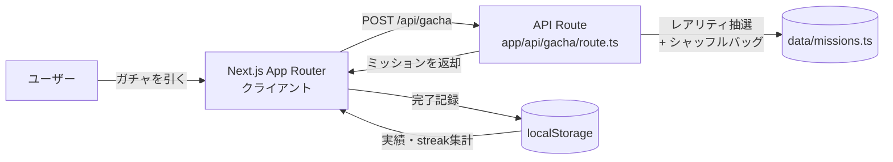

# Gachaly

## チーム名

pushで寝る

## プロダクト名

Gachaly

## 概要

Gachalyは、「何をすればいいか分からない」という日常のちょっとした停滞感を、ワンクリックのガチャで突破するWebアプリです。ボタンを押すとレアリティ付きの小さなミッションが1つ提示され、それに挑戦して完了ボタンを押すだけで実績として記録されます。特に時間に余裕のある夏休み期間の大学生をターゲットに、「何もしなかった一日」を「何かをした一日」に変える最初の一歩を後押しします。

## デモ

- 発表資料URL：[未定]
- デモURL：[未定]
- デモ動画：[未定]
- スクリーンショット：[未定]

## システム構成



- フロントエンドはNext.js（App Router）上でガチャ画面・実績画面を描画
- ミッションの抽選はサーバー側のAPI Route（`app/api/gacha/route.ts`）で実施
- 完了履歴は外部DBを使わず、クライアントのlocalStorageのみで永続化

## 背景・課題

朝起きたときに「今日は何をしよう」という予定が事前に決まっていればいいが、決まっていない時間をどう使うか悩んでしまうことは多い。悩む時間自体は大切だが、悩みすぎて一日を無駄にしてしまうのはもったいない。そこで、まず「行動1」を提案してあげることで、その後の一日を充実させられるのではないかと考えた。「何もしなかった（説明できない）一日」を「何かをした（説明できる）一日」に変えることを目指している。特に大学生は夏休みに入り自由な時間が多くなるため、このアプリが役立つ場面が増えると考えている。

## 主な機能

- 機能1：ガチャ抽選（レアリティ付きミッションの提示）
- 機能2：完了記録・実績画面（通算突破数・連続突破日数の表示）
- 機能3：レアリティ演出・完了メッセージ（ノーマル／レア／スーパーレアで表示が変化）

## 工夫した点・こだわった点

- ミッションの抽選ロジックは、暗号学的乱数（Node.jsの`crypto`）とレアリティごとのシャッフルバッグ方式を採用し、出現頻度に偏りが出ないよう設計している
- ガチャの仕組み自体はシンプルだからこそ、誰が見ても直感的に分かりやすく、認知度の高いUI/UXになるよう意識している
- ミッションの体験価値を損なわないよう、レアリティごとのバランスを考えて排出率を設計している

## 使用技術

- フロントエンド：Next.js（App Router）+ TypeScript、素のCSS
- バックエンド：Next.js API Route
- AI / API：なし（今後の展望で活用を検討）
- データベース：なし（永続化はクライアントのlocalStorageのみ）
- インフラ：Railway
- その他：Node.js `crypto`モジュールによる暗号学的乱数抽選

## 今後の展望

- 実績機能の拡充（バッジ判定など）を最優先で進める
- ユーザーの傾向に合わせたミッション提案機能（AI活用も検討中、実現可否は要調査）

## セットアップ方法

```bash
git clone <repository-url>
cd hakkit

# 必要なライブラリをインストール
npm install

# 開発サーバー起動
npm run dev

# 本番ビルド・起動
npm run build
npm run start
```

## メンバー

| 名前 | 担当 |
|---|---|
| 岡田 悠暉 | リーダー |
| 福島 巧己 | フロントエンド |
| 佐藤 優成 | バックエンド（実績・デプロイ） |
| 北村 空也 | バックエンド（ガチャロジック） |
