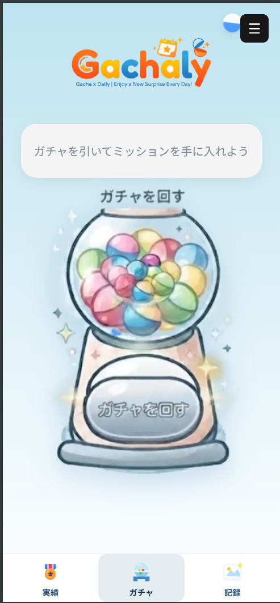
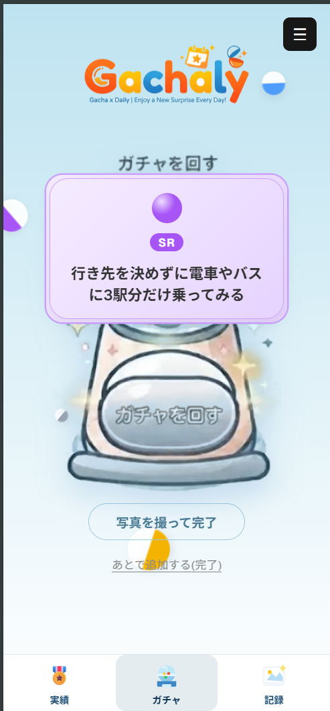
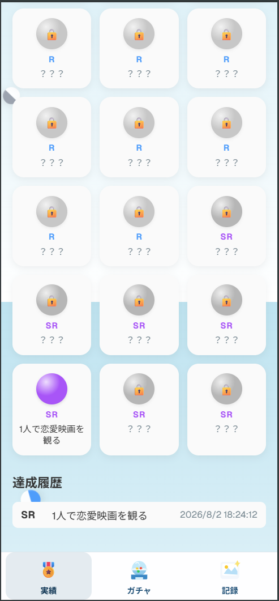
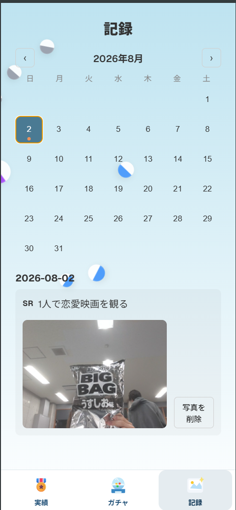
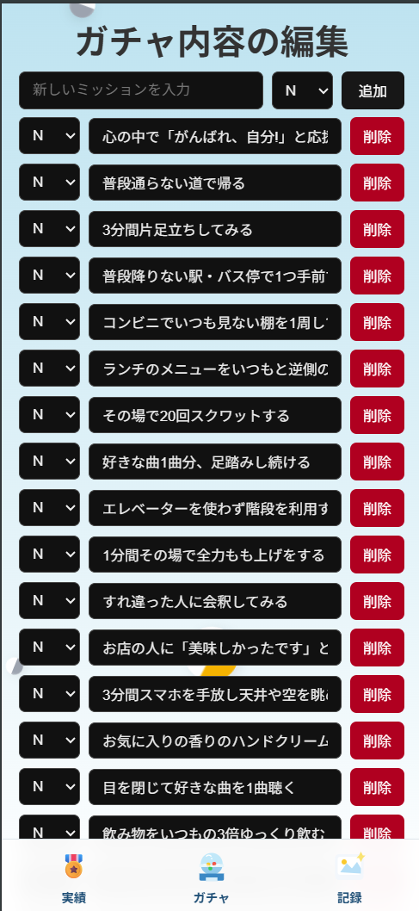
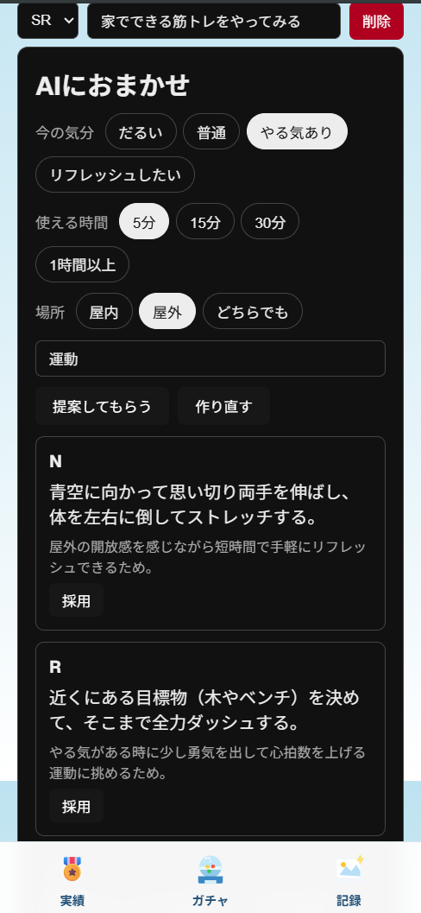
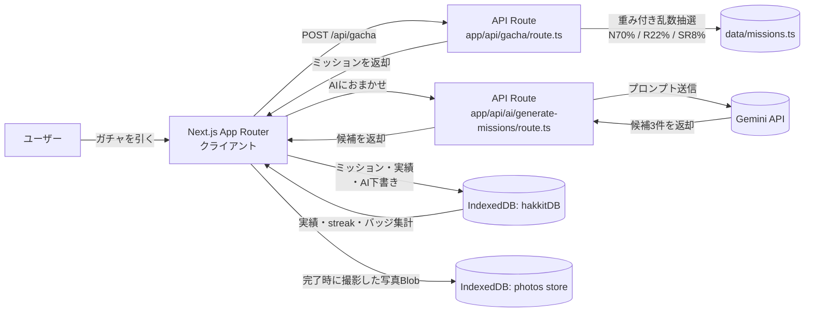

<div align="center">


### 「何しよう」を、ワンクリックで「やった」に変える

[](https://nextjs.org/)
[](https://www.typescriptlang.org/)
[](https://react.dev/)
[](https://ai.google.dev/)
[](https://railway.app/)

</div>

---

# Gachaly

## チーム名

pushで寝る

## プロダクト名

Gachaly

## 概要

Gachalyは、「何をすればいいか分からない」という日常のちょっとした停滞感を、ワンクリックのガチャで突破するWebアプリです。ボタンを押すとレアリティ付きの小さなミッションが1つ提示され、それに挑戦して完了ボタンを押すだけで実績として記録されます。特に時間に余裕のある夏休み期間の大学生をターゲットに、「何もしなかった一日」を「何かをした一日」に変える最初の一歩を後押しします。

## デモ

- 発表資料URL：https://www.canva.com/design/DAHRHDeSSPc/mgW0_--NtatDxCWptKyL_g/view?utm_content=DAHRHDeSSPc&utm_campaign=designshare&utm_medium=link2&utm_source=uniquelinks&utlId=hea6aa94403
- デモURL：https://hakkit-production.up.railway.app/

### デモ動画

[▶️ デモ動画を再生（docs/videos/demo.mp4）](docs/videos/demo.mp4)

> GitHub上で開くと、そのままブラウザ内蔵のプレーヤーで再生できます。

### スクリーンショット

<!--
  撮影後、以下のファイル名で docs/images/ に保存すると自動的に表示されます。
  例: docs/images/01-top.png
-->

<table>
  <tr>
    <td align="center" width="33%">
      <br />
      トップ（初期状態）
    </td>
    <td align="center" width="33%">
      <br />
      ガチャ結果（レアリティ演出）
    </td>
    <td align="center" width="33%">
      <br />
      実績・ミッション図鑑
    </td>
  </tr>
  <tr>
    <td align="center" width="33%">
      <br />
      記録画面（カレンダー）
    </td>
    <td align="center" width="33%">
      <br />
      ガチャ内容の編集
    </td>
    <td align="center" width="33%">
      <br />
      AIにおまかせ提案
    </td>
  </tr>
</table>


## システム構成



- フロントエンドはNext.js（App Router）上でガチャ画面・実績画面・記録カレンダー・BGM設定画面を描画
- ミッションの抽選はサーバー側のAPI Route（`app/api/gacha/route.ts`）で実施
- AIミッション提案はサーバー側のAPI Route（`app/api/ai/generate-missions/route.ts`）がGemini APIを呼び出し、構造化出力（JSON）で候補を生成
- 完了履歴・カスタムミッション・AI下書きは外部DBを使わず、クライアントのIndexedDB（`idb`ライブラリ、DB名`hakkitDB`）のみで永続化。撮影写真は別途IndexedDBの`photos`ストアにBlobとして保存

## 背景・課題

朝起きたときに「今日は何をしよう」という予定が事前に決まっていればいいが、決まっていない時間をどう使うか悩んでしまうことは多い。悩む時間自体は大切だが、悩みすぎて一日を無駄にしてしまうのはもったいない。そこで、まず「行動1」を提案してあげることで、その後の一日を充実させられるのではないかと考えた。「何もしなかった（説明できない）一日」を「何かをした（説明できる）一日」に変えることを目指している。特に大学生は夏休みに入り自由な時間が多くなるため、このアプリが役立つ場面が増えると考えている。

## 主な機能

- **ガチャ抽選**：ボタン1つでレアリティ付きミッションを1件提示（重み付き乱数 N:70% / R:22% / SR:8%）
- **完了記録・実績画面**：通算突破数、連続突破日数（streak）、レアリティ別内訳を表示
- **バッジ・ミッション図鑑**：「はじめの一歩」「駆け出し」「常連」「SRコレクター」「週間チャレンジャー」など達成条件付きバッジと、達成済みミッションが埋まっていくコレクション画面
- **レアリティ演出・完了メッセージ**：ノーマル／レア／スーパーレアで表示が変化
- **写真付き記録**：ミッション完了時にカメラで撮影、または後から記録画面で追加。日付ごとのカレンダーから過去の記録・写真を閲覧・削除可能
- **ガチャ内容のカスタム編集**：ミッション文・レアリティの手動追加／編集／削除、デフォルト構成へのリセット
- **AIにおまかせミッション提案**：気分・使える時間・場所・任意のテーマを選ぶと、Gemini APIが3件のミッション候補（文章＋レアリティ＋提案理由）を生成。気に入った候補だけを採用してガチャ内容に追加できる
- **BGM設定**：複数トラックからの選択と音量調整（設定はlocalStorageに保存）

## 工夫した点・こだわった点

- ガチャの仕組み自体はシンプルだからこそ、誰が見ても直感的に分かりやすく、認知度の高いUI/UXになるよう意識している
- ミッションの体験価値を損なわないよう、レアリティごとのバランスを考えて排出率を設計している
- AI提案機能はGeminiの`responseSchema`で出力形式を構造化し、不正な候補（レアリティ不正・空文字など）をサーバー側でフィルタリングすることで表示崩れを防止
- AI・IndexedDBが失敗してもアプリ全体が止まらないよう、各所でtry/catchによるフォールバック（デフォルトミッションへの切り替え、手動追加フォームは常に使用可能）を徹底

## 使用技術

| カテゴリ | 技術 |
|---|---|
| フロントエンド |    素のCSS |
| バックエンド | Next.js API Route |
| AI / API | （ミッション候補の構造化生成） |
| データベース | なし（サーバー側は非永続。永続化はすべてクライアントのIndexedDB、`idb`ライブラリを使用） |
| インフラ |  |
| その他 | `crypto.randomUUID()`によるID発行 |

## 環境変数

| 変数名 | 用途 | スコープ |
|---|---|---|
| `GEMINI_API_KEY` | Gemini API認証キー（AIミッション提案機能で使用） | サーバーのみ（`NEXT_PUBLIC_`を付けない） |
| `GEMINI_MODEL` | 使用モデル名（省略時 `gemini-flash-latest`） | サーバーのみ（任意） |

ローカル開発では`.env.local`に設定し、本番環境ではRailwayの対象サービスのVariablesに設定する。

## 今後の展望

- ミッション達成履歴やコレクションのSNSシェア機能
- ユーザー同士でミッションを投稿・共有できるコミュニティ機能
- ログイン機能＋サーバー側DBを追加し、複数端末での実績・ガチャ内容の同期に対応
- AI提案の履歴閲覧・再利用UI（現状は下書きをIndexedDBに保存するのみ）
- 達成した写真をまとめて振り返れるアルバム／タイムライン表示

## セットアップ方法

```bash
git clone <repository-url>
cd hakkit

# 必要なライブラリをインストール
npm install

# .env.local を作成し、GEMINI_API_KEY 等を設定（AI提案機能を使う場合）

# 開発サーバー起動
npm run dev

# 本番ビルド・起動
npm run build
npm run start
```

## メンバー

| 名前 | 担当 |
|---|---|
| 岡田 悠暉 | リーダー・タスク管理 |
| 福島 巧己 | フロントエンド |
| 佐藤 優成 | バックエンド（実績・デプロイ） |
| 北村 空也 | バックエンド（ガチャロジック） |

---